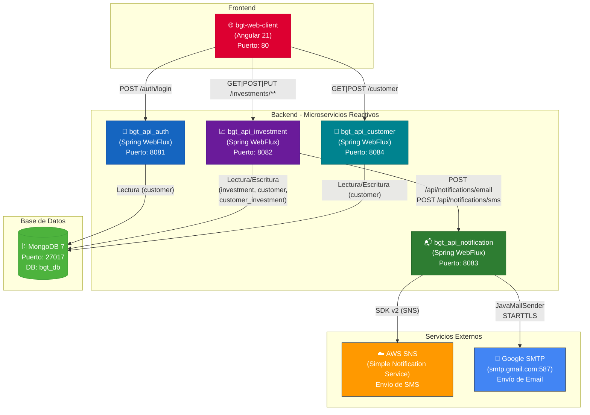

# Parte 1 – Fondos (80%)

## BGT Pactual – Plataforma de Gestión de Fondos de Inversión

### Descripción

Plataforma de gestión de fondos de inversión desarrollada con arquitectura de **microservicios reactivos** utilizando **Spring Boot 4 / Spring WebFlux** en el backend y **Angular 21** en el frontend. El sistema permite a los clientes gestionar sus inversiones (suscripción y cancelación de fondos), autenticarse de forma segura mediante **JWT (HS256)** y recibir notificaciones por **SMS** (vía AWS SNS) y **email** (vía Google SMTP). Toda la comunicación backend es no bloqueante (reactiva) y todos los servicios persisten datos en **MongoDB 7**.

---

### Stack Tecnológico

| Capa | Tecnología | Versión |
|------|-----------|---------|
| Frontend | Angular (Standalone Components, Signals, RxJS) | 21.2.0 |
| Backend | Spring Boot + Spring WebFlux | 4.0.3 |
| Seguridad | Spring Security + JJWT (HS256) | 6 / 0.12.6 |
| Base de datos | MongoDB (Reactive Driver) | 7 |
| Contenedores | Docker + Docker Compose | — |
| Notif. SMS | AWS SNS SDK v2 | 2.25.0 |
| Notif. Email | Google SMTP (JavaMailSender) | — |
| Infraestructura | AWS EC2 + CloudFormation | — |
| Java | OpenJDK | 17 |
| TypeScript | — | ~5.9 |

---

### Arquitectura del Sistema



---

### Evidencia de Consumo desde el Frontend

Evidencia del funcionamiento completo del sistema: frontend Angular consumiendo los microservicios del backend en tiempo real.


---

### Puertos de los Servicios

| Componente              | Tecnología             | Puerto |
|-------------------------|------------------------|--------|
| `bgt-web-client`        | Angular 21 (Nginx)     | 80     |
| `bgt_api_auth`          | Spring WebFlux         | 8081   |
| `bgt_api_investment`    | Spring WebFlux         | 8082   |
| `bgt_api_notification`  | Spring WebFlux         | 8083   |
| `bgt_api_customer`      | Spring WebFlux         | 8084   |
| `mongodb`               | MongoDB 7              | 27017  |

---

### Estructura del Proyecto

```
BGTPactual/
├── bgt_api_auth/           # Microservicio: autenticación y JWT
├── bgt_api_investment/     # Microservicio: fondos y suscripciones
├── bgt_api_notification/   # Microservicio: email y SMS
├── bgt_api_customer/       # Microservicio: registro y perfil de clientes
├── bgt-web-client/         # Frontend Angular 21
├── bgt_database/
│   ├── NoSQL/              # Scripts MongoDB (colecciones + datos iniciales)
│   └── SQL/                # Scripts PostgreSQL (Parte 2 – SQL)
├── docker-compose.yml             # Orquestación de todos los servicios
├── template.yaml                  # AWS CloudFormation para despliegue en EC2
├── desplegar.sh                   # Script de build, push y arranque
└── BGT Pactual.postman_collection.json  # Colección Postman con todos los endpoints
```

---

### Microservicios – API REST

#### 1. `bgt_api_auth` — Autenticación (Puerto 8081)

Responsable de verificar credenciales y emitir tokens JWT firmados con HS256.

**Endpoints:**

| Método | Ruta | Auth | Descripción |
|--------|------|------|-------------|
| `POST` | `/auth/login` | No | Autentica al usuario y devuelve JWT |

**Login – Request:**
```json
{ "username": "wilmerescobar", "password": "password123" }
```

**Login – Response:**
```json
{
  "token": "eyJhbGciOiJIUzI1NiJ9...",
  "tokenType": "Bearer",
  "expiresIn": 3600000,
  "username": "wilmerescobar"
}
```

**Clases principales:**

| Clase | Responsabilidad |
|-------|----------------|
| `AuthController` | Expone `POST /auth/login` |
| `AuthService` | Valida credenciales (BCrypt) y delega generación de token |
| `JwtService` | Genera y valida tokens JWT (HS256, 1 hora) |
| `SecurityConfig` | WebFlux Security: CSRF deshabilitado, sin form login |
| `MongoConfig` | Conversor `Date ↔ LocalDate` para MongoDB |
| `CustomerRepository` | Repositorio reactivo MongoDB: colección `customer` |

---

#### 2. `bgt_api_customer` — Clientes (Puerto 8084)

Gestiona el registro de clientes y la consulta del perfil autenticado.

**Endpoints:**

| Método | Ruta | Auth | Descripción |
|--------|------|------|-------------|
| `POST` | `/customer` | No | Registra un nuevo cliente |
| `GET` | `/customer` | Sí (JWT) | Devuelve el perfil del cliente autenticado |

**Register – Request:**
```json
{
  "names": "Wilmer",
  "lastnames": "Escobar",
  "birthday": "1993-01-30",
  "documentType": "CC",
  "documentNumber": "108530",
  "cellphone": "3122423574",
  "email": "wilmer@example.com",
  "username": "wilmerescobar",
  "passUser": "password123"
}
```

**GET /customer – Response:**
```json
{
  "id": "507f1f77bcf86cd799439011",
  "username": "wilmerescobar",
  "amount": 500000.00,
  "names": "Wilmer",
  "lastnames": "Escobar"
}
```

**Reglas de negocio:**
- Saldo inicial al registrarse: **$500,000**
- La contraseña se almacena con hash BCrypt
- El `username` tiene índice único en MongoDB

**Clases principales:**

| Clase | Responsabilidad |
|-------|----------------|
| `CustomerController` | Expone `POST /customer` y `GET /customer` |
| `CustomerService` | Registro, codificación de contraseña, consulta de perfil |
| `JwtAuthenticationWebFilter` | Extrae y valida el token JWT en cada petición |
| `GlobalExceptionHandler` | Manejo centralizado de errores (400/401/500) |
| `CustomerRepository` | Repositorio reactivo MongoDB: colección `customer` |

---

#### 3. `bgt_api_investment` — Inversiones (Puerto 8082)

Catálogo de fondos y gestión del ciclo completo de suscripción/cancelación. Se comunica con `bgt_api_notification` de forma no bloqueante tras cada operación.

**Endpoints:**

| Método | Ruta | Auth | Descripción |
|--------|------|------|-------------|
| `GET` | `/investments/catalog` | No | Lista todos los fondos disponibles |
| `GET` | `/investments` | Sí (JWT) | Historial de inversiones del cliente |
| `POST` | `/investments/subscribe` | Sí (JWT) | Suscribirse a un fondo |
| `PUT` | `/investments/unsubscribe/{id}` | Sí (JWT) | Cancelar una suscripción activa |

**GET /investments/catalog – Response:**
```json
{
  "message": "Catálogo de inversiones obtenido exitosamente",
  "data": [
    { "id": "...", "name": "FPV_BTG_PACTUAL_RECAUDADORA", "minAmount": 75000.00, "category": "FPV" },
    { "id": "...", "name": "FPV_BTG_PACTUAL_ECOPETROL",   "minAmount": 125000.00, "category": "FPV" },
    { "id": "...", "name": "DEUDAPRIVADA",                 "minAmount": 50000.00,  "category": "FIC" },
    { "id": "...", "name": "FDO-ACCIONES",                 "minAmount": 250000.00, "category": "FIC" },
    { "id": "...", "name": "FPV_BTG_PACTUAL_DINAMICA",     "minAmount": 100000.00, "category": "FPV" }
  ]
}
```

**POST /investments/subscribe – Request:**
```json
{
  "investment": "507f1f77bcf86cd799439011",
  "amount": 100000.00,
  "notificationEmail": true,
  "notificationSms": false
}
```

**Flujo suscripción:**
1. Busca el cliente por `username` (extraído del JWT)
2. Valida que `amount ≥ minAmount` del fondo
3. Valida que el saldo del cliente sea suficiente
4. Descuenta el monto del saldo del cliente (update atómico)
5. Crea registro `CustomerInvestment` con estado `"A"` (Activo)
6. Llama a `bgt_api_notification` si se solicitó email/SMS (errores de notificación no bloquean la suscripción)

**Flujo cancelación:**
1. Valida que el cliente sea dueño de la suscripción
2. Verifica que el estado sea `"A"` (Activo)
3. Restaura el monto al saldo del cliente
4. Actualiza estado a `"C"` (Cancelado) y registra `closedAt`

**Clases principales:**

| Clase | Responsabilidad |
|-------|----------------|
| `InvestmentController` | Expone los 4 endpoints |
| `CustomerInvestmentService` | Lógica de negocio suscripción/cancelación |
| `NotificationWebClient` | WebClient reactivo hacia `bgt_api_notification` |
| `WebClientConfig` | Bean `WebClient` con base URL configurable |
| `InvestmentRepository` | Colección `investment` |
| `CustomerRepository` | Colección `customer` (lectura/actualización de saldo) |
| `CustomerInvestmentRepository` | Colección `customer_investment` |

---

#### 4. `bgt_api_notification` — Notificaciones (Puerto 8083)

Entrega notificaciones multi-canal. Expone endpoints protegidos por JWT que son invocados exclusivamente por `bgt_api_investment`.

**Endpoints:**

| Método | Ruta | Auth | Descripción |
|--------|------|------|-------------|
| `POST` | `/api/notifications/email` | Sí (JWT) | Envía correo vía Google SMTP |
| `POST` | `/api/notifications/sms` | Sí (JWT) | Envía SMS vía AWS SNS |

**POST /api/notifications/email – Request:**
```json
{
  "to": "cliente@example.com",
  "subject": "Apertura fondo de inversiones",
  "message": "Se ha realizado la apertura de un nuevo fondo..."
}
```

**POST /api/notifications/sms – Request:**
```json
{
  "phoneNumber": "+573122423574",
  "message": "Se ha realizado la apertura de un nuevo fondo..."
}
```

**Response (éxito):**
```json
{ "message": "Email enviado a cliente@example.com", "status": "SENT", "messageId": "..." }
```

**Detalles técnicos:**
- **EmailService:** usa `JavaMailSender` en scheduler `boundedElastic()` (non-blocking).
- **SmsService:** usa `SnsAsyncClient` del SDK v2. Valida formato E.164 (`^\+[1-9]\d{7,14}$`).
- **PII masking:** emails y teléfonos se enmascaran en los logs (`MaskingUtils`).

**Clases principales:**

| Clase | Responsabilidad |
|-------|----------------|
| `NotificationController` | Expone los 2 endpoints |
| `EmailService` | Envío de email con JavaMailSender |
| `SmsService` | Envío de SMS con AWS SNS Async SDK v2 |
| `AwsSnsConfig` | Configura `SnsAsyncClient` con credenciales y región |
| `GlobalExceptionHandler` | Errores 400/401/500 con DTOs estructurados |
| `MaskingUtils` | Ofuscación de PII en logs |

---

### Frontend – `bgt-web-client` (Angular 21)

SPA construida con **Standalone Components**, **Signals** y carga diferida (lazy loading). Se sirve con Nginx en producción (puerto 80).

**Rutas:**

| Ruta | Componente | Auth | Descripción |
|------|-----------|------|-------------|
| `/login` | `LoginComponent` | No | Login y registro de clientes |
| `/dashboard` | `DashboardComponent` | Sí | Contenedor con navegación lateral |
| `/dashboard/catalog` | `CatalogComponent` | Sí | Catálogo de fondos y suscripción |
| `/dashboard/history` | `HistoryComponent` | Sí | Historial con paginación y cancelación |
| `**` | — | — | Redirige a `/login` |

**Servicios:**

| Servicio | Responsabilidad |
|---------|----------------|
| `AuthService` | Login, logout, gestión del token JWT (Signal) |
| `CustomerService` | Registro, perfil del cliente, refresco reactivo |
| `InvestmentService` | Catálogo, historial, suscripción, cancelación |

**Características clave:**
- `authGuard` protege todas las rutas bajo `/dashboard`
- `authInterceptor` inyecta `Authorization: Bearer <token>` en cada petición HTTP
- Señales (`signal`, `computed`) para estado reactivo sin NgRx
- Proxy Angular (`proxy.conf.json`) redirige `/auth`, `/investments`, `/customer` al backend en desarrollo

**Proxy de desarrollo (`proxy.conf.json`):**
```json
{
  "/auth":        { "target": "http://localhost:8081", "changeOrigin": true },
  "/investments": { "target": "http://localhost:8082", "changeOrigin": true },
  "/customer":    { "target": "http://localhost:8084", "changeOrigin": true }
}
```

---

### Base de Datos MongoDB — Colecciones

#### `customer`
```javascript
{
  "_id": ObjectId,
  "names": String,
  "lastnames": String,
  "birthday": Date,
  "document_type": String,   // "CC", "CE", etc.
  "document_number": String,
  "cellphone": String,
  "email": String,
  "username": String,        // índice único
  "pass_user": String,       // hash BCrypt
  "amount": Decimal128,      // saldo disponible
  "created_at": Date
}
```

#### `investment`
```javascript
{
  "_id": ObjectId,
  "name": String,            // nombre del fondo
  "min_amount": Decimal128,  // monto mínimo de suscripción
  "category": String         // "FPV" | "FIC"
}
```

#### `customer_investment`
```javascript
{
  "_id": ObjectId,
  "id_customer": ObjectId,    // referencia a customer
  "id_investment": ObjectId,  // referencia a investment
  "opened_at": Date,
  "closed_at": Date,          // null si activo
  "invested_amount": Decimal128,
  "status": String            // "A" (Activo) | "C" (Cancelado)
}
```

**Scripts de inicialización** (directorio `bgt_database/NoSQL/`):
- `01_create_collections.js` — crea colecciones con validadores JSON Schema
- `02_insert_investment.js` — inserta los 5 fondos del catálogo
- `03_insert_customer.js` — inserta el cliente de prueba inicial

---

### Colección Postman

En la raíz del proyecto se incluye el archivo **`BGT Pactual.postman_collection.json`** con todos los endpoints del sistema listos para importar y ejecutar.

| Request | Método | URL |
|---------|--------|-----|
| Auth Login | `POST` | `http://localhost:8081/auth/login` |
| Investment Fondos disponibles | `GET` | `http://localhost:8082/investments/catalog` |
| Investment Historial | `GET` | `http://localhost:8082/investments` |
| Investment Apertura | `POST` | `http://localhost:8082/investments/subscribe` |
| Investment Cancelación | `PUT` | `http://localhost:8082/investments/unsubscribe/{id}` |
| Notification email | `POST` | `http://localhost:8083/api/notifications/email` |
| Notification sms | `POST` | `http://localhost:8083/api/notifications/sms` |
| Customer Registrar | `POST` | `http://localhost:8084/customer` |
| Customer obtener | `GET` | `http://localhost:8084/customer` |

> **Nota:** El request "Auth Login" incluye un script de test en Postman que extrae automáticamente el token de la respuesta y lo guarda en la variable de entorno `{{token}}`, la cual es usada por todos los demás requests que requieren autenticación.

---

### Despliegue

#### Opción 1 – Docker Compose (local)

```bash
# Build + push + arranque completo (requiere Docker Hub login)
chmod +x desplegar.sh
./desplegar.sh
```

El script `desplegar.sh`:
1. Detiene y elimina contenedores e imágenes existentes
2. Construye cada imagen desde su `Dockerfile`
3. Publica las imágenes en Docker Hub (`wilmerescobar/*`)
4. Levanta todo el stack con `docker compose up -d`

**Servicios en `docker-compose.yml`:**

| Servicio | Imagen | Puerto |
|---------|--------|--------|
| `mongodb` | `mongo:7` | 27017 |
| `bgt_api_auth` | `wilmerescobar/bgt-api-auth:latest` | 8081 |
| `bgt_api_investment` | `wilmerescobar/bgt-api-investment:latest` | 8082 |
| `bgt_api_notification` | `wilmerescobar/bgt-api-notification:latest` | 8083 |
| `bgt_api_customer` | `wilmerescobar/bgt-api-customer:latest` | 8084 |
| `bgt_web_client` | `wilmerescobar/bgt-web-client:latest` | 80 |

Red: bridge personalizada `bgt_network`. MongoDB incluye health check con `mongosh ping` antes de que los servicios dependientes arranquen.

#### Opción 2 – AWS EC2 con CloudFormation (`template.yaml`)

Despliega la plataforma completa en una instancia EC2 Ubuntu 22.04 LTS. El *UserData* instala Docker, descarga los scripts de MongoDB, genera dinámicamente el `docker-compose.yml` con los parámetros del stack y arranca todos los servicios.

**Parámetros del stack:**
- Tipo de instancia (`m7i-flex.large` / `xlarge` / `2xlarge`)
- Key pair SSH
- Credenciales Docker Hub
- `JWT_SECRET` (mínimo 32 caracteres)
- `GOOGLE_EMAIL` / `GOOGLE_PASSWORD`
- `AWS_ACCESS_KEY` / `AWS_SECRET_KEY`

**Salidas:** IP pública y DNS público de la instancia.

---

### Variables de Entorno

| Variable | Servicios | Descripción |
|----------|-----------|-------------|
| `SPRING_MONGODB_URI` | auth, investment, customer | URI de conexión a MongoDB |
| `SPRING_MONGODB_DATABASE` | auth, investment, customer | Nombre de la base de datos |
| `JWT_SECRET` | todos los backends | Clave secreta JWT HS256 (≥ 32 chars, debe ser idéntica en los 4 servicios) |
| `NOTIFICATION_SERVICE_URL` | investment | URL de `bgt_api_notification` (ej. `http://bgt_api_notification:8083`) |
| `GOOGLE_EMAIL` | notification | Cuenta Gmail para envío de correos |
| `GOOGLE_PASSWORD` | notification | App Password de Gmail (no la contraseña de la cuenta) |
| `AWS_ACCESS_KEY` | notification | Access Key de AWS con permisos SNS |
| `AWS_SECRET_KEY` | notification | Secret Key de AWS |
| `AWS_REGION` | notification | Región AWS (default: `us-east-1`) |

> **Importante:** `JWT_SECRET` debe ser exactamente la misma cadena en los cuatro microservicios backend. Configurarlo con menos de 32 caracteres genera error al firmar tokens con HS256.

---

### Scripts de Base de Datos

**`bgt_database/NoSQL/`** – MongoDB:
- `01_create_collections.js` — Crea las colecciones `customer`, `investment` y `customer_investment` con validadores JSON Schema estrictos
- `02_insert_investment.js` — Inserta los 5 fondos del catálogo inicial
- `03_insert_customer.js` — Inserta el cliente de prueba (`wilmerescobar`, saldo $500,000)

---
---

# Parte 2 – SQL (20%)

### Descripción

A modo de ejemplo se hace un insert con datos en PostgreSQL.

---

### Consulta Solicitada

> Obtener los nombres de los clientes que tienen inscrito algún producto disponible **solo** en las sucursales que visitan.

---

### Consulta SQL Propuesta

```sql
SELECT DISTINCT c.nombre, c.apellidos
FROM cliente c
JOIN inscripcion i ON i.id_cliente = c.id
JOIN disponibilidad d ON d.id_producto = i.id_producto
LEFT JOIN visitan v ON v.id_sucursal = d.id_sucursal
                   AND v.id_cliente  = c.id
GROUP BY c.id, c.nombre, c.apellidos, i.id_producto
HAVING COUNT(*) = COUNT(v.id_sucursal);
```

---

### Datos Utilizados

#### Esquema de Base de Datos (PostgreSQL)

```sql
-- =============================================
-- Esquema de base de datos PostgreSQL
-- =============================================

DROP TABLE IF EXISTS visitan;
DROP TABLE IF EXISTS disponibilidad;
DROP TABLE IF EXISTS inscripcion;
DROP TABLE IF EXISTS producto;
DROP TABLE IF EXISTS sucursal;
DROP TABLE IF EXISTS cliente;

CREATE TABLE cliente (
    id          SERIAL       PRIMARY KEY,
    nombre      VARCHAR(100) NOT NULL,
    apellidos   VARCHAR(150) NOT NULL,
    ciudad      VARCHAR(100) NOT NULL
);

CREATE TABLE sucursal (
    id          SERIAL       PRIMARY KEY,
    nombre      VARCHAR(100) NOT NULL,
    ciudad      VARCHAR(100) NOT NULL
);

CREATE TABLE producto (
    id              SERIAL       PRIMARY KEY,
    nombre          VARCHAR(100) NOT NULL,
    tipo_producto   VARCHAR(100) NOT NULL
);

CREATE TABLE inscripcion (
    id_producto INTEGER NOT NULL,
    id_cliente  INTEGER NOT NULL,
    PRIMARY KEY (id_producto, id_cliente),
    FOREIGN KEY (id_producto) REFERENCES producto(id) ON DELETE CASCADE,
    FOREIGN KEY (id_cliente)  REFERENCES cliente(id)  ON DELETE CASCADE
);

-- No todas las sucursales ofrecen los mismos productos
CREATE TABLE disponibilidad (
    id_sucursal INTEGER NOT NULL,
    id_producto INTEGER NOT NULL,
    PRIMARY KEY (id_sucursal, id_producto),
    FOREIGN KEY (id_sucursal) REFERENCES sucursal(id) ON DELETE CASCADE,
    FOREIGN KEY (id_producto) REFERENCES producto(id) ON DELETE CASCADE
);

CREATE TABLE visitan (
    id_sucursal   INTEGER NOT NULL,
    id_cliente    INTEGER NOT NULL,
    fecha_visita  DATE    NOT NULL,
    PRIMARY KEY (id_sucursal, id_cliente),
    FOREIGN KEY (id_sucursal) REFERENCES sucursal(id) ON DELETE CASCADE,
    FOREIGN KEY (id_cliente)  REFERENCES cliente(id)  ON DELETE CASCADE
);
```

#### Inserción de Datos

```sql
-- =============================================
-- Clientes
-- =============================================
INSERT INTO cliente (nombre, apellidos, ciudad) VALUES
('Carlos',    'García López',     'Bogotá'),
('María',     'Rodríguez Pérez',  'Medellín'),
('Andrés',    'Martínez Ruiz',    'Cali'),
('Luisa',     'Fernández Torres', 'Barranquilla'),
('Jorge',     'Hernández Díaz',   'Bogotá'),
('Camila',    'López Moreno',     'Medellín'),
('Santiago',  'Ramírez Castro',   'Cartagena'),
('Valentina', 'Gómez Vargas',     'Cali');

-- =============================================
-- Sucursales
-- =============================================
INSERT INTO sucursal (nombre, ciudad) VALUES
('Sucursal Centro',     'Bogotá'),
('Sucursal Norte',      'Bogotá'),
('Sucursal Poblado',    'Medellín'),
('Sucursal Chipichape', 'Cali'),
('Sucursal Caribe',     'Barranquilla'),
('Sucursal Bocagrande', 'Cartagena');

-- =============================================
-- Productos
-- =============================================
INSERT INTO producto (nombre, tipo_producto) VALUES
('Cuenta de Ahorros',          'Bancario'),
('Tarjeta de Crédito',         'Bancario'),
('CDT',                        'Inversión'),
('Fondo de Inversión',         'Inversión'),
('Seguro de Vida',             'Seguros'),
('Seguro Vehicular',           'Seguros'),
('Crédito Hipotecario',        'Crédito'),
('Crédito de Libre Inversión', 'Crédito');

-- =============================================
-- Disponibilidad (NO todas las sucursales ofrecen lo mismo)
-- =============================================

-- Sucursal Centro (Bogotá) → todos los productos
INSERT INTO disponibilidad (id_sucursal, id_producto) VALUES
(1,1),(1,2),(1,3),(1,4),(1,5),(1,6),(1,7),(1,8);

-- Sucursal Norte (Bogotá) → solo bancarios y créditos
INSERT INTO disponibilidad (id_sucursal, id_producto) VALUES
(2,1),(2,2),(2,7),(2,8);

-- Sucursal Poblado (Medellín) → bancarios, inversión y crédito hipotecario
INSERT INTO disponibilidad (id_sucursal, id_producto) VALUES
(3,1),(3,2),(3,3),(3,4),(3,7);

-- Sucursal Chipichape (Cali) → bancarios y seguros
INSERT INTO disponibilidad (id_sucursal, id_producto) VALUES
(4,1),(4,2),(4,5),(4,6);

-- Sucursal Caribe (Barranquilla) → cuenta, tarjeta y seguro de vida
INSERT INTO disponibilidad (id_sucursal, id_producto) VALUES
(5,1),(5,2),(5,5);

-- Sucursal Bocagrande (Cartagena) → solo cuenta y tarjeta
INSERT INTO disponibilidad (id_sucursal, id_producto) VALUES
(6,1),(6,2);

-- =============================================
-- Inscripciones
-- =============================================
INSERT INTO inscripcion (id_producto, id_cliente) VALUES
(1, 1),  -- Carlos      → Cuenta de Ahorros
(2, 1),  -- Carlos      → Tarjeta de Crédito
(7, 1),  -- Carlos      → Crédito Hipotecario
(1, 2),  -- María       → Cuenta de Ahorros
(3, 2),  -- María       → CDT
(4, 2),  -- María       → Fondo de Inversión
(1, 3),  -- Andrés      → Cuenta de Ahorros
(5, 3),  -- Andrés      → Seguro de Vida
(6, 3),  -- Andrés      → Seguro Vehicular
(2, 4),  -- Luisa       → Tarjeta de Crédito
(5, 4),  -- Luisa       → Seguro de Vida
(1, 5),  -- Jorge       → Cuenta de Ahorros
(8, 5),  -- Jorge       → Crédito Libre Inversión
(1, 6),  -- Camila      → Cuenta de Ahorros
(2, 6),  -- Camila      → Tarjeta de Crédito
(3, 6),  -- Camila      → CDT
(1, 7),  -- Santiago    → Cuenta de Ahorros
(2, 7),  -- Santiago    → Tarjeta de Crédito
(1, 8),  -- Valentina   → Cuenta de Ahorros
(2, 8),  -- Valentina   → Tarjeta de Crédito
(5, 8);  -- Valentina   → Seguro de Vida

-- =============================================
-- Visitas
-- =============================================
INSERT INTO visitan (id_sucursal, id_cliente, fecha_visita) VALUES
(1, 1, '2026-01-15'),  -- Carlos    → Sucursal Centro
(2, 1, '2026-02-20'),  -- Carlos    → Sucursal Norte
(3, 2, '2026-01-10'),  -- María     → Sucursal Poblado
(4, 3, '2026-02-05'),  -- Andrés    → Sucursal Chipichape
(5, 4, '2026-03-01'),  -- Luisa     → Sucursal Caribe
(1, 5, '2026-02-28'),  -- Jorge     → Sucursal Centro
(3, 6, '2026-01-22'),  -- Camila    → Sucursal Poblado
(6, 7, '2026-03-10'),  -- Santiago  → Sucursal Bocagrande
(4, 8, '2026-02-14'),  -- Valentina → Sucursal Chipichape
(3, 1, '2026-03-05'),  -- Carlos    → Sucursal Poblado
(2, 5, '2026-03-08');  -- Jorge     → Sucursal Norte
```

### Resultado de la Consulta

| nombre | apellidos      |
|--------|----------------|
| Carlos | García López   |
| Jorge  | Hernández Díaz |

---

### Desarrollador

**[wilmerescobarb](https://github.com/wilmerescobarb)**
