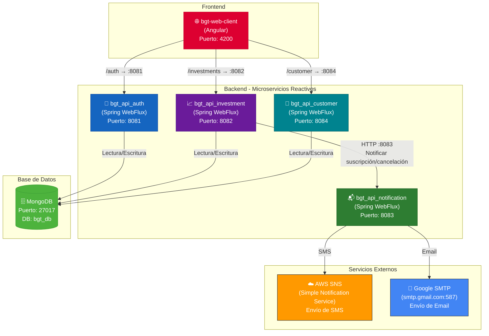

# Parte 1 – Fondos (80%)

## BGT Pactual – Plataforma de Gestión de Fondos de Inversión

### Descripción

Plataforma de gestión de fondos de inversión desarrollada con una arquitectura de microservicios reactivos usando **Spring WebFlux** en el backend y **Angular** en el frontend. El sistema permite a los clientes gestionar sus inversiones (suscripción y cancelación de fondos), autenticarse de forma segura mediante JWT y recibir notificaciones por **SMS** (vía AWS SNS) y **email** (vía Google SMTP). Todos los microservicios se comunican de forma no bloqueante y están conectados a una base de datos **MongoDB** compartida.

---

### Arquitectura del Sistema



---

### Evidencia de Consumo desde el Frontend

Si bien la prueba técnica está orientada al desarrollo Backend, se adjunta evidencia del funcionamiento completo del sistema, mostrando un frontend en Angular consumiendo los microservicios del backend en tiempo real.


---

### Puertos de los Microservicios

| Componente              | Tecnología     | Puerto |
|-------------------------|----------------|--------|
| bgt-web-client          | Angular        | 4200   |
| bgt_api_auth            | Spring WebFlux | 8081   |
| bgt_api_investment      | Spring WebFlux | 8082   |
| bgt_api_notification    | Spring WebFlux | 8083   |
| bgt_api_customer        | Spring WebFlux | 8084   |
| MongoDB                 | NoSQL DB       | 27017  |

---

### Scripts de Base de Datos

En el directorio **`bgt_database/`** se encuentran los scripts de base de datos del proyecto:

- **`bgt_database/NoSQL/`** — Scripts de MongoDB para la creación de colecciones e inserción de datos iniciales:
  - `01_create_collections.js`
  - `02_insert_investment.js`
  - `03_insert_customer.js`

- **`bgt_database/SQL/`** — Scripts SQL (PostgreSQL) de los microservicios:
  - `01_create_tables.sql`
  - `03_insert_investment.sql`
  - `04_insert_customer.sql`

---

### Archivos de Configuración

A continuación se detallan los archivos de configuración relevantes y las propiedades que se deben tener en cuenta para las conexiones a BD, servicios externos, etc.

#### 1. `bgt_api_auth/src/main/resources/application.yaml`

```yaml
spring:
  data:
    mongodb:
      host: localhost
      port: 27017
      database: bgt_db

server:
  port: 8081

jwt:
  secret: <JWT_SECRET>
  expiration-ms: 3600000
```

> **Datos sensibles:** Configurar `jwt.secret` con una clave segura de al menos 32 caracteres (HS256).

---

#### 2. `bgt_api_investment/src/main/resources/application.yaml`

```yaml
spring:
  data:
    mongodb:
      host: localhost
      port: 27017
      database: bgt_db

server:
  port: 8082

jwt:
  secret: <JWT_SECRET>   # Debe coincidir con bgt_api_auth

notification:
  service:
    url: http://localhost:8083   # URL del microservicio de notificaciones
```

> **Importante:** La propiedad `notification.service.url` apunta al microservicio de notificaciones para enviar alertas de suscripción/cancelación de fondos.

---

#### 3. `bgt_api_notification/src/main/resources/application.yaml`

```yaml
spring:
  mail:
    host: smtp.gmail.com
    port: 587
    username: <GMAIL_USER>
    password: <GMAIL_APP_PASSWORD>
    properties:
      mail:
        smtp:
          auth: true
          starttls:
            enable: true

server:
  port: 8083

app:
  mail:
    from: <GMAIL_USER>

aws:
  access-key: <AWS_ACCESS_KEY>
  secret-key: <AWS_SECRET_KEY>
  region: us-east-1

jwt:
  secret: <JWT_SECRET>   # Debe coincidir con bgt_api_auth
```

> **Conexiones externas requeridas:**
> - **Google SMTP:** Se necesita una cuenta de Gmail con una *App Password* generada para el envío de correos electrónicos.
> - **AWS SNS:** Se requieren credenciales de AWS (access-key, secret-key) con permisos en el servicio SNS para el envío de SMS.

---

#### 4. `bgt_api_customer/src/main/resources/application.yaml`

```yaml
spring:
  data:
    mongodb:
      host: localhost
      port: 27017
      database: bgt_db

server:
  port: 8084

jwt:
  secret: <JWT_SECRET>   # Debe coincidir con bgt_api_auth
```

---

#### 5. `bgt-web-client/proxy.conf.json`

```json
{
  "/auth": {
    "target": "http://localhost:8081",
    "secure": false,
    "changeOrigin": true
  },
  "/investments": {
    "target": "http://localhost:8082",
    "secure": false,
    "changeOrigin": true
  },
  "/customer": {
    "target": "http://localhost:8084",
    "secure": false,
    "changeOrigin": true
  }
}
```

> **Nota:** El proxy de Angular redirige las peticiones HTTP a los microservicios correspondientes, evitando problemas de CORS durante el desarrollo.

---

### Resumen de Variables Sensibles

| Variable                | Servicio            | Descripción                                  |
|-------------------------|---------------------|----------------------------------------------|
| `jwt.secret`            | Todos los backends  | Clave secreta JWT (debe ser idéntica en los 4)|
| `spring.data.mongodb.*` | auth, investment, customer | Conexión a MongoDB                    |
| `aws.access-key`        | notification        | Access Key de AWS para SNS                   |
| `aws.secret-key`        | notification        | Secret Key de AWS para SNS                   |
| `spring.mail.username`  | notification        | Cuenta Gmail para envío de correos           |
| `spring.mail.password`  | notification        | App Password de Gmail                        |

---
---

# Parte 2 – SQL (20%)

### Descripción

A modo de ejemplo se hace un insert con datos en PostgreSQL.

---

### Consulta Solicitada

> Obtener los nombres de los clientes que tienen inscrito algún producto disponible **solo** en las sucursales que visitan.

---

### Consulta SQL Propuesta

```sql
SELECT DISTINCT c.nombre, c.apellidos
FROM cliente c
JOIN inscripcion i ON i.id_cliente = c.id
JOIN disponibilidad d ON d.id_producto = i.id_producto
LEFT JOIN visitan v ON v.id_sucursal = d.id_sucursal
                   AND v.id_cliente  = c.id
GROUP BY c.id, c.nombre, c.apellidos, i.id_producto
HAVING COUNT(*) = COUNT(v.id_sucursal);
```

---

### Datos Utilizados

#### Esquema de Base de Datos (PostgreSQL)

```sql
-- =============================================
-- Esquema de base de datos PostgreSQL
-- =============================================

DROP TABLE IF EXISTS visitan;
DROP TABLE IF EXISTS disponibilidad;
DROP TABLE IF EXISTS inscripcion;
DROP TABLE IF EXISTS producto;
DROP TABLE IF EXISTS sucursal;
DROP TABLE IF EXISTS cliente;

CREATE TABLE cliente (
    id          SERIAL       PRIMARY KEY,
    nombre      VARCHAR(100) NOT NULL,
    apellidos   VARCHAR(150) NOT NULL,
    ciudad      VARCHAR(100) NOT NULL
);

CREATE TABLE sucursal (
    id          SERIAL       PRIMARY KEY,
    nombre      VARCHAR(100) NOT NULL,
    ciudad      VARCHAR(100) NOT NULL
);

CREATE TABLE producto (
    id              SERIAL       PRIMARY KEY,
    nombre          VARCHAR(100) NOT NULL,
    tipo_producto   VARCHAR(100) NOT NULL
);

CREATE TABLE inscripcion (
    id_producto INTEGER NOT NULL,
    id_cliente  INTEGER NOT NULL,
    PRIMARY KEY (id_producto, id_cliente),
    FOREIGN KEY (id_producto) REFERENCES producto(id) ON DELETE CASCADE,
    FOREIGN KEY (id_cliente)  REFERENCES cliente(id)  ON DELETE CASCADE
);

-- No todas las sucursales ofrecen los mismos productos
CREATE TABLE disponibilidad (
    id_sucursal INTEGER NOT NULL,
    id_producto INTEGER NOT NULL,
    PRIMARY KEY (id_sucursal, id_producto),
    FOREIGN KEY (id_sucursal) REFERENCES sucursal(id) ON DELETE CASCADE,
    FOREIGN KEY (id_producto) REFERENCES producto(id) ON DELETE CASCADE
);

CREATE TABLE visitan (
    id_sucursal   INTEGER NOT NULL,
    id_cliente    INTEGER NOT NULL,
    fecha_visita  DATE    NOT NULL,
    PRIMARY KEY (id_sucursal, id_cliente),
    FOREIGN KEY (id_sucursal) REFERENCES sucursal(id) ON DELETE CASCADE,
    FOREIGN KEY (id_cliente)  REFERENCES cliente(id)  ON DELETE CASCADE
);
```

#### Inserción de Datos

```sql
-- =============================================
-- Clientes
-- =============================================
INSERT INTO cliente (nombre, apellidos, ciudad) VALUES
('Carlos',    'García López',     'Bogotá'),
('María',     'Rodríguez Pérez',  'Medellín'),
('Andrés',    'Martínez Ruiz',    'Cali'),
('Luisa',     'Fernández Torres', 'Barranquilla'),
('Jorge',     'Hernández Díaz',   'Bogotá'),
('Camila',    'López Moreno',     'Medellín'),
('Santiago',  'Ramírez Castro',   'Cartagena'),
('Valentina', 'Gómez Vargas',     'Cali');

-- =============================================
-- Sucursales
-- =============================================
INSERT INTO sucursal (nombre, ciudad) VALUES
('Sucursal Centro',     'Bogotá'),
('Sucursal Norte',      'Bogotá'),
('Sucursal Poblado',    'Medellín'),
('Sucursal Chipichape', 'Cali'),
('Sucursal Caribe',     'Barranquilla'),
('Sucursal Bocagrande', 'Cartagena');

-- =============================================
-- Productos
-- =============================================
INSERT INTO producto (nombre, tipo_producto) VALUES
('Cuenta de Ahorros',          'Bancario'),
('Tarjeta de Crédito',         'Bancario'),
('CDT',                        'Inversión'),
('Fondo de Inversión',         'Inversión'),
('Seguro de Vida',             'Seguros'),
('Seguro Vehicular',           'Seguros'),
('Crédito Hipotecario',        'Crédito'),
('Crédito de Libre Inversión', 'Crédito');

-- =============================================
-- Disponibilidad (NO todas las sucursales ofrecen lo mismo)
-- =============================================

-- Sucursal Centro (Bogotá) → todos los productos
INSERT INTO disponibilidad (id_sucursal, id_producto) VALUES
(1,1),(1,2),(1,3),(1,4),(1,5),(1,6),(1,7),(1,8);

-- Sucursal Norte (Bogotá) → solo bancarios y créditos
INSERT INTO disponibilidad (id_sucursal, id_producto) VALUES
(2,1),(2,2),(2,7),(2,8);

-- Sucursal Poblado (Medellín) → bancarios, inversión y crédito hipotecario
INSERT INTO disponibilidad (id_sucursal, id_producto) VALUES
(3,1),(3,2),(3,3),(3,4),(3,7);

-- Sucursal Chipichape (Cali) → bancarios y seguros
INSERT INTO disponibilidad (id_sucursal, id_producto) VALUES
(4,1),(4,2),(4,5),(4,6);

-- Sucursal Caribe (Barranquilla) → cuenta, tarjeta y seguro de vida
INSERT INTO disponibilidad (id_sucursal, id_producto) VALUES
(5,1),(5,2),(5,5);

-- Sucursal Bocagrande (Cartagena) → solo cuenta y tarjeta
INSERT INTO disponibilidad (id_sucursal, id_producto) VALUES
(6,1),(6,2);

-- =============================================
-- Inscripciones
-- =============================================
INSERT INTO inscripcion (id_producto, id_cliente) VALUES
(1, 1),  -- Carlos      → Cuenta de Ahorros
(2, 1),  -- Carlos      → Tarjeta de Crédito
(7, 1),  -- Carlos      → Crédito Hipotecario
(1, 2),  -- María       → Cuenta de Ahorros
(3, 2),  -- María       → CDT
(4, 2),  -- María       → Fondo de Inversión
(1, 3),  -- Andrés      → Cuenta de Ahorros
(5, 3),  -- Andrés      → Seguro de Vida
(6, 3),  -- Andrés      → Seguro Vehicular
(2, 4),  -- Luisa       → Tarjeta de Crédito
(5, 4),  -- Luisa       → Seguro de Vida
(1, 5),  -- Jorge       → Cuenta de Ahorros
(8, 5),  -- Jorge       → Crédito Libre Inversión
(1, 6),  -- Camila      → Cuenta de Ahorros
(2, 6),  -- Camila      → Tarjeta de Crédito
(3, 6),  -- Camila      → CDT
(1, 7),  -- Santiago    → Cuenta de Ahorros
(2, 7),  -- Santiago    → Tarjeta de Crédito
(1, 8),  -- Valentina   → Cuenta de Ahorros
(2, 8),  -- Valentina   → Tarjeta de Crédito
(5, 8);  -- Valentina   → Seguro de Vida

-- =============================================
-- Visitas
-- =============================================
INSERT INTO visitan (id_sucursal, id_cliente, fecha_visita) VALUES
(1, 1, '2026-01-15'),  -- Carlos    → Sucursal Centro
(2, 1, '2026-02-20'),  -- Carlos    → Sucursal Norte
(3, 2, '2026-01-10'),  -- María     → Sucursal Poblado
(4, 3, '2026-02-05'),  -- Andrés    → Sucursal Chipichape
(5, 4, '2026-03-01'),  -- Luisa     → Sucursal Caribe
(1, 5, '2026-02-28'),  -- Jorge     → Sucursal Centro
(3, 6, '2026-01-22'),  -- Camila    → Sucursal Poblado
(6, 7, '2026-03-10'),  -- Santiago  → Sucursal Bocagrande
(4, 8, '2026-02-14'),  -- Valentina → Sucursal Chipichape
(3, 1, '2026-03-05'),  -- Carlos    → Sucursal Poblado
(2, 5, '2026-03-08');  -- Jorge     → Sucursal Norte
```

### Resultado de la Consulta

| nombre | apellidos      |
|--------|----------------|
| Carlos | García López   |
| Jorge  | Hernández Díaz |

---

### Desarrollador

**[wilmerescobarb](https://github.com/wilmerescobarb)**
